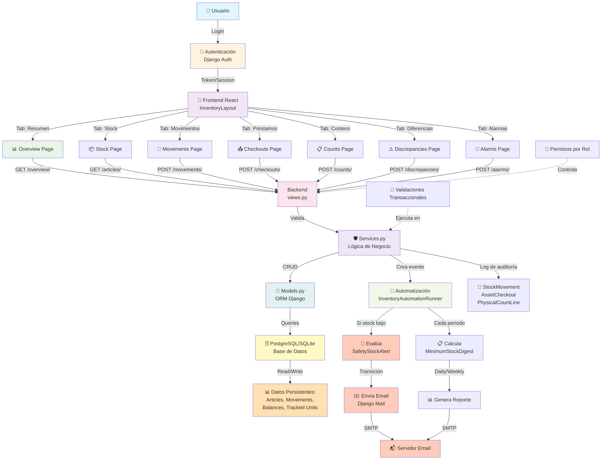

# Flujo General del Sistema de Inventario

Este diagrama muestra la arquitectura completa del sistema desde que un usuario inicia sesión hasta que interactúa con diferentes módulos del inventario.

## Vista General

## Componentes Principales

### 🔐 Capa de Autenticación
- Django Auth valida credenciales del usuario
- Genera token/session para usar la API

### 📱 Frontend React
- InventoryLayout es el contenedor principal
- 7 pestañas para diferentes operaciones
- utils.js para validaciones y formateo

### 🔌 API REST (Backend)
- Endpoints en views.py
- Decoradores para autenticación y validación de roles
- Rutas definidas en urls.py

### ⚙️ Lógica de Negocio (Services)
- services.py centraliza la lógica
- CRUD operations
- Validaciones transaccionales
- Cálculo de stocks

### 💾 Datos (ORM Django)
- models.py define la estructura
- ORM Django traduce a SQL
- Base de datos persiste los datos

### 🤖 Automatización
- Thread InventoryAutomationRunner corre continuamente
- Evalúa alertas de stock mínimo
- Envía emails automáticamente

### 📧 Externa
- Django Mail integra con SMTP
- Envía notificaciones a usuarios

## Flujo de Datos Típico

1. Usuario accede a module/stock
2. Frontend llama GET /api/articles/
3. Backend autentica usuario
4. Services obtiene artículos de BD
5. Frontend renderiza tabla
6. Usuario hace cambio (ej: crear movimiento)
7. Frontend POST a /api/inventory/movements/
8. Backend valida, actualiza BD
9. Automatización detecta cambio
10. Si es crítico, envía email

## Consideraciones

- ✅ Todas las operaciones requieren autenticación
- ✅ Permisos basados en rol (STOREKEEPER, SUPERVISOR, etc)
- ✅ Auditoría registra quién hizo qué y cuándo
- ✅ Automatización es asincrónica (no bloquea API)
- ⚠️ Emails pueden fallar (retry manejo en automación)
