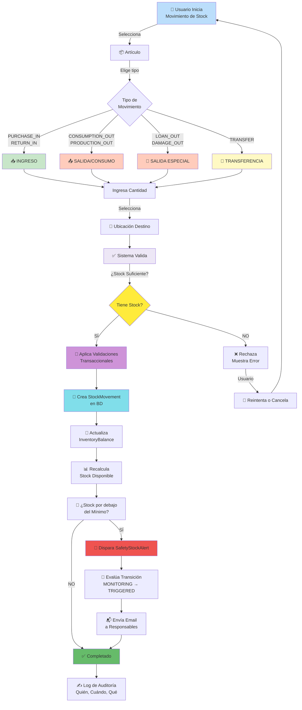

# Flujo Detallado de Movimiento de Stock

Este diagrama detalla paso a paso cómo el sistema procesa un movimiento de stock, desde que el usuario lo inicia hasta que se registra en la auditoría y se disparan alertas.

## Flujo Completo



## Tipos de Movimiento Soportados

### 📥 **INGRESO (Entrada de Stock)**

| Tipo | Descripción | Quién puede? | Requiere? |
|------|-------------|-------------|-----------|
| PURCHASE_IN | Compra de proveedor | STOREKEEPER | reason_text |
| RETURN_IN | Devolución a almacén | STOREKEEPER | - |
| ADJUSTMENT_IN | Ajuste positivo | SUPERVISOR | reason_text |

### 📤 **SALIDA (Disminución de Stock)**

| Tipo | Descripción | Quién puede? | Requiere? |
|------|-------------|-------------|-----------|
| CONSUMPTION_OUT | Consumo/uso | STOREKEEPER | sector |
| PRODUCTION_OUT | Asignación a producción | STOREKEEPER | sector |
| DISPOSAL_OUT | Baja/descarte | SUPERVISOR | reason_text |
| DAMAGE_OUT | Daño | SUPERVISOR | reason_text |
| LOAN_OUT | Préstamo a persona | STOREKEEPER | person |

### 🔄 **TRANSFER (Transferencia entre ubicaciones)**

- Origen ≠ Destino (validación)
- Requiere: source_location, target_location
- Crea 2 movimientos (salida del origen, entrada al destino)

## Validaciones Transaccionales

```
BEGIN TRANSACTION
  1. ¿Artículo existe?
  2. ¿Tracking mode permite movimiento?
  3. ¿Stock suficiente? (para egreso)
  4. ¿Ubicación destino válida?
  5. ¿Usuario tiene permiso?
  6. ¿Campos obligatorios completos?
┌─ Si TODO OK:
│   ├─ Crea registro StockMovement
│   ├─ Actualiza InventoryBalance
│   └─ COMMIT
│
└─ Si ALGÚN ERROR:
    └─ ROLLBACK (nada se guarda)
```

## Después del Movimiento

### 1. Recálculo de Stock Disponible
- Stock disponible = on_hand - reserved
- Se recalcula automáticamente
- Se cachea para queries rápidas

### 2. Evaluación de Alertas
```
Si nuevo_stock < minimum_stock:
  ├─ SafetyStockAlert status = TRIGGERED
  ├─ Se envía email SOLO en transición MONITORING → TRIGGERED
  └─ Idempotente: no envía duplicados
```

### 3. Auditoría
Se registra:
- Quién creó el movimiento (created_by)
- Quién autorizó (authorized_by - opcional)
- Timestamp exacto
- Tipo de movimiento
- Razón/notas

## Manejo de Errores

### ❌ Error: Stock Insuficiente
```
¿Intentar salida de 100 unidades pero solo hay 50?
→ Rechazado en validación
→ Mensaje claro al usuario
→ NO se persiste nada en BD
```

### ❌ Error: Falta de Permisos
```
¿Usuario OPERATOR intenta crear DAMAGE_OUT?
→ Role validation falla
→ Retorna 403 Forbidden
→ Auditoría registra intento
```

### ❌ Error: Ubicación inválida
```
¿Transferencia a ubicación que no existe?
→ Validación de FK falla
→ Retorna 400 Bad Request
```

## Rendimiento

### Índices recomendados
- `inventory_stockmovement` (article_id, created_at DESC)
- `inventory_balance` (article_id, location_id) UNIQUE
- `inventory_article` (internal_code) UNIQUE

### Queries típicas
- Obtener balance: O(1) - indexed lookup
- Listar movimientos: O(n) - con paginación
- Calcular stock: O(1) - cached en InventoryBalance

## Ejemplo Real

**Escenario:** Almacenero consume guantes nitrilo

```
Input:
  - Artículo: "Guantes Nitrilo Talla M" (GUA-N-M)
  - Cantidad: 10
  - Tipo: CONSUMPTION_OUT
  - Sector: Producción
  - Ubicación origen: Almacén Principal
  - Motivo: "Consumo turno mañana"

Validaciones:
  ✅ Artículo existe
  ✅ Tracking mode = QUANTITY (por cantidad)
  ✅ Stock: 150 on_hand - 0 reserved = 150 disponible
  ✅ 10 < 150 = OK
  ✅ Usuario es STOREKEEPER = OK

Cambios:
  - InventoryBalance: on_hand 150 → 140
  - StockMovement: Nuevo registro creado
  - Auditoría: "Consumo de 10 unidades"

Post-procesamiento:
  - Nuevo stock: 140
  - Mínimo: 50
  - Alerta: NO (140 > 50)
  - Email: NO

Status: ✅ COMPLETADO
```

## Consideraciones Importantes

⚠️ **Integridad de Datos**
- Transacciones ACID garantizan consistencia
- No es posible que quede "a medio camino"

⚠️ **Auditoría**
- Todos los movimientos quedan registrados
- Se pueden auditar cambios históricos

⚠️ **Alertas**
- Se disparan después de guardar movimiento
- Envío de email es asincrónico (falla no afecta API)

⚠️ **Performance**
- Movimientos masivos pueden ser lentos
- Se recomienda batch import vía Excel
