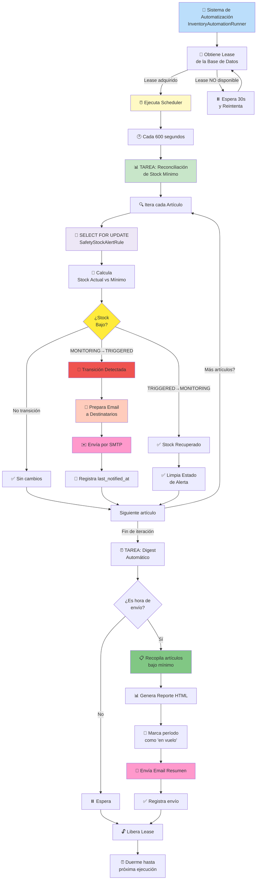

# Ciclo de Automatización de Alertas y Digests

Este diagrama explica cómo el sistema `InventoryAutomationRunner` (un thread background) ejecuta tareas periódicamente, evaluando alertas de stock bajo y enviando digests automáticos.

## Arquitectura de Automatización



## Componentes Clave

### 🔄 Lease Management (Control Distribuido)

**Problema:** ¿Qué pasa si hay múltiples instancias del servidor?

```
Servidor 1: Obtiene Lease (TTL=90s) → Ejecuta tareas
Servidor 2: Intenta Lease → Espera 30s → Reintenta

Si Servidor 1 muere:
  Leak "muere sin liberar lease"
  → Otros servidores esperan hasta que expire (90s)
  → Automáticamente toman control (takeover)
```

**Implementación:**
- Tabla `InventoryAutomationTaskState` en BD
- `lease_expires_at`: timestamp de expiración
- `owner_token` + `owner_label`: identifica quién tiene lease
- SELECT FOR UPDATE garantiza exclusividad

### 📊 TAREA 1: Reconciliation (Cada 600 segundos = 10 minutos)

**Objetivo:** Evaluar si stock de cada artículo bajó por debajo de mínimo

```
Para cada SafetyStockAlertRule:
  1. Calcula stock actual
  2. Compara con minimum_stock
  
  Si stock < minimum:
    ├─ Estado cambió a TRIGGERED?
    │  └─ Sí: Envía email AHORA
    └─ Estado sigue TRIGGERED?
       └─ Sí: NO envía (evita spam)
  
  Si stock >= minimum:
    └─ Estado cambió DE TRIGGERED?
       └─ Sí: Limpia estado
```

**Idempotencia:**
- Email se envía SOLO cuando transición MONITORING → TRIGGERED
- Aunque tarea se re-ejecute, no manda duplicado
- `last_notified_at` previene re-envíos

**Ejemplo:**

```
Artículo: "Guantes Nitrilo"
Minimum: 50
Stock actual: 45

¿Transición?
  Anterior: MONITORING
  Actual: TRIGGERED (45 < 50)
  
Resultado: ✅ Envía email "ALERTA: Stock bajo"

5 minutos después (próxima tarea):
Artículo: "Guantes Nitrilo"
Stock actual: 45 (sin cambios)

¿Transición?
  Anterior: TRIGGERED
  Actual: TRIGGERED (45 < 50)
  
Resultado: ❌ NO envía email (mismo estado)
```

### 📋 TAREA 2: Digest Automático (Daily o Weekly)

**Objetivo:** Enviar resumen de todos los artículos bajo mínimo

**Configuración:**
```python
MinimumStockDigestConfig:
  - is_enabled: True/False
  - frequency: "daily" o "weekly"
  - run_at: Hora (ej: 08:00)
  - run_weekday: Día si es semanal (ej: "lunes")
  - recipients: Lista de usuarios
  - additional_emails: Correos externos
```

**Ejecución:**

```
¿Es hora de envío? NO
  → Espera

¿Es hora de envío? SÍ
  1. Recopila todos artículos bajo mínimo
  2. Genera tabla HTML con detalles
  3. Marca período como "en vuelo"
  4. Envía email a recipients
  5. Registra last_notified_at
     
¿Falla el envío de email?
  → Registra error en last_email_error
  → Próximo ciclo intenta nuevamente
  → Sistema no se cae
```

**Período de Ejecución:**

Evita duplicados con sistema de "períodos":
```
Period Key = "daily_2026_04_10" (YYYY_MM_DD)

1er Run:
  - Calcula period_key = "daily_2026_04_10"
  - Compara con inflight_period_key (vacío)
  - Ejecuta y envía email
  - Guarda inflight_period_key = "daily_2026_04_10"

2do Run (misma día):
  - Calcula period_key = "daily_2026_04_10"
  - Compara con inflight_period_key (same!)
  - Salta (ya procesado hoy)

Próximo día:
  - Calcula period_key = "daily_2026_04_11"
  - Es diferente → Ejecuta nuevamente
```

## Ciclo Completo

```
INICIO (runserver inicia)
  ↓
¿Crear tareas? → ensure_automation_task_states()
  ↓
InventoryAutomationRunner() → Start thread
  ↓
Loop infinito cada 30s:
  ├─ Intenta obtener lease
  │   ├─ Si ÉXITO:
  │   │   ├─ Ejecuta Reconciliation cada 600s
  │   │   ├─ Ejecuta Digest cada horaconf
  │   │   └─ Libera lease
  │   │
  │   └─ Si FRACASO:
  │       └─ Espera 30s y reintenta
  │
  ├─ Duerme N segundos
  └─ Repite

Si error no-crítico:
  - Log y continúa
  
Si error crítico:
  - Log y thread muere (otro server toma control)
```

## Estados de Tareas

### `InventoryAutomationTaskState`

| Campo | Propósito |
|-------|-----------|
| `key` | Identifica tarea (scheduler, reconcile, digest) |
| `runtime_state` | idle, running, disabled |
| `owner_token` | UUID del server actual |
| `owner_label` | Nombre del server (para logs) |
| `lease_expires_at` | Cuándo expira derecho a ejecutar |
| `heartbeat_at` | Último latido |
| `last_started_at` | Cuándo empezó último run |
| `last_finished_at` | Cuándo terminó |
| `last_success_at` | Último éxito |
| `last_warning_at` | Última advertencia |
| `last_error_at` | Último error |
| `last_run_status` | never, success, warning, error, skipped |
| `run_count` | Cantidad de ejecuciones |

## Consideraciones Críticas

### ⚠️ Fault Tolerance
```
Server 1: Crashea durante ReconciliationTask
  → Lease expira en 90 segundos
  → Server 2 obtiene lease automáticamente
  → Sistema sigue funcionando sin intervención manual
```

### ⚠️ Idempotencia
```
Email_ID = hash(article_id + task_type + timestamp_period)

Si sistema intenta enviar mismo email 2 veces:
  → Mismo hash
  → Sistema detecta y no envía
```

### ⚠️ Performance
```
1,000 artículos × 10 minutos = 100 art/min
  → ~1.7 art/seg
  → Con queries optimizadas: muy rápido
  → Sin índices: puede tardar mucho
```

### ⚠️ Email Failures
```
SMTP server down:
  → Email falla
  → Se registra error
  → Próximo run intenta nuevamente
  → NO afecta resto del sistema
  → NO genera alertas falsas
```

## Configuración Recomendada

```python
# settings.py

# Reconciliation cada 10 minutos
INVENTORY_RECONCILE_INTERVAL = 600

# Lease TTL 90 segundos
INVENTORY_LEASE_TTL = 90

# Digest diario a las 8 AM
INVENTORY_DIGEST_FREQUENCY = "daily"
INVENTORY_DIGEST_TIME = "08:00"

# Emails habilitados para producción
INVENTORY_ALARM_EMAILS_ENABLED = True
DEFAULT_FROM_EMAIL = "inventario@company.com"
```

## Debugging

### Ver estado actual
```python
from inventory.models import InventoryAutomationTaskState

InventoryAutomationTaskState.objects.all().values()
# {
#   'key': 'scheduler',
#   'runtime_state': 'idle',
#   'owner_label': 'MacBook-Pro.local',
#   'lease_expires_at': 2026-04-10 14:32:15,
#   ...
# }
```

### Forzar Digest
```python
from inventory.services import dispatch_minimum_stock_digest

dispatch_minimum_stock_digest()  # Envía email AHORA
```

### Reset para Testing
```python
from inventory.automation import reset_inventory_automation_runner_for_tests

reset_inventory_automation_runner_for_tests()
```
