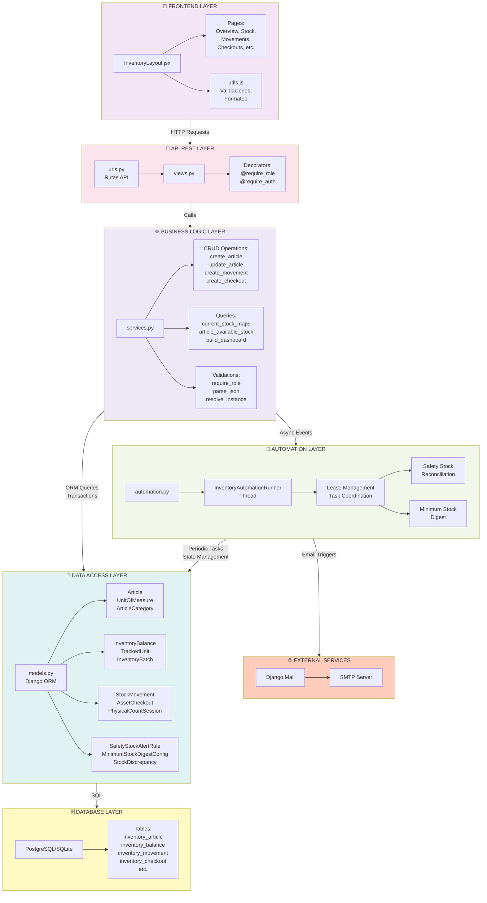

# Arquitectura del Backend - Capas y Componentes

Este diagrama muestra la estructura en capas del backend del módulo de inventario, desde la interfaz del usuario hasta los datos persistidos.

## Arquitectura en Capas



## Descripción de Capas

### 🎨 FRONTEND LAYER

**Responsabilidad:** Interfaz de usuario y presentación

**Componentes:**
- `InventoryLayout.jsx` - Contenedor principal
- Pages específicas para cada operación
- `utils.js` - Funciones compartidas

**Tecnología:**
- React
- Estado local con hooks
- Validación básica pre-submit

**Boundary:**
- Comunica con backend vía HTTP REST
- Espera JSON estructurado

---

### 🔌 API REST LAYER

**Responsabilidad:** Exponer endpoints HTTP seguros

**Archivo:** `views.py`

**Componentes:**

```python
# Decoradores de seguridad
@require_auth()
@require_role("STOREKEEPER", "SUPERVISOR")
def create_movement(request):
    ...

# Decoradores aplican:
✓ Autenticación (token/session válido?)
✓ Autorización (roles correctos?)
✓ Request parsing (JSON válido?)
✓ Response formatting (siempre JSON)
```

**Endpoints típicos:**
- `GET /api/articles/` - Listar artículos
- `POST /api/articles/` - Crear artículo
- `POST /api/inventory/movements/` - Crear movimiento
- `POST /api/inventory/checkouts/` - Crear préstamo

**HTTP Status Codes:**
- 200 OK - Éxito lectura
- 201 Created - Éxito creación
- 400 Bad Request - Datos inválidos
- 401 Unauthorized - Sin autenticación
- 403 Forbidden - Sin permisos
- 404 Not Found - Recurso no existe
- 500 Server Error - Error no esperado

---

### ⚙️ BUSINESS LOGIC LAYER

**Responsabilidad:** Lógica de negocio, validaciones, cálculos

**Archivo:** `services.py`

**Grupos de Funciones:**

#### 1. **CRUD Operations**
```python
create_article(...)      # Crea nuevo artículo
update_article(...)      # Modifica artículo
get_article_detail(...)  # Obtiene con stock actual
list_articles(...)       # Lista todos
```

#### 2. **Stock Management**
```python
current_stock_maps()           # Stock actual (por artículo)
article_current_stock(article) # Stock total
article_available_stock(...)   # Stock disponible (no reserved)
get_or_create_balance(...)     # Balance por ubicación
apply_balance_delta(...)       # Suma/resta cantidad
```

#### 3. **Movement Operations**
```python
create_movement(...)       # Registra movimiento
serialize_movement(...)    # Convierte a JSON
```

#### 4. **Checkout Operations**
```python
create_checkout(...)       # Registra préstamo
return_checkout(...)       # Devuelve unidad
serialize_checkout(...)    # Convierte a JSON
```

#### 5. **Counting & Discrepancies**
```python
create_count_session(...)   # Inicia conteo
add_count_line(...)         # Registra línea
create_discrepancy(...)     # Registra diferencia
resolve_discrepancy(...)    # Resuelve diferencia
```

#### 6. **Alerts & Automation**
```python
evaluate_safety_stock_alert(...)        # Evalúa si stock bajó
send_safety_stock_alert_email(...)      # Envía email
dispatch_minimum_stock_digest(...)      # Envía resumen
```

#### 7. **Validations & Helpers**
```python
require_role(user, "STOREKEEPER")     # Autorización
parse_json(request.body)               # Parsing seguro
resolve_instance(model, id)            # Obtiene FK
validate_article(article_data)         # Valida campos
```

**Transacciones ACID:**
```python
with transaction.atomic():
    # Todo aquí es todo-o-nada
    stockmovement = StockMovement.objects.create(...)
    balance.apply_delta(...)
    # Si alguna falla → ROLLBACK
```

---

### 💾 DATA ACCESS LAYER

**Responsabilidad:** Modelos de datos y interacción con BD

**Archivo:** `models.py`

**Categorías de Modelos:**

#### **Maestro de Datos**
- `Article` - Artículos/SKU
- `ArticleCategory` - Categorías jerárquicas
- `UnitOfMeasure` - Unidades de medida
- `Sector` - Departamentos
- `Person` - Personal
- `Supplier` - Proveedores
- `Location` - Ubicaciones físicas

#### **Trazabilidad**
- `InventoryBalance` - Stock por artículo/ubicación/lote
- `InventoryBatch` - Lotes con vencimiento
- `TrackedUnit` - Unidades individuales (CON-001, etc)

#### **Operaciones**
- `StockMovement` - Entrada/salida/transferencia
- `AssetCheckout` - Préstamo de unidades
- `PhysicalCountSession` - Sesión de conteo
- `PhysicalCountLine` - Línea de conteo
- `StockDiscrepancy` - Diferencia encontrada

#### **Automatización**
- `SafetyStockAlertRule` - Regla de alerta individual
- `MinimumStockDigestConfig` - Config de digest automático
- `InventoryAutomationTaskState` - Estado de tareas

**Herencia Base:**
```python
class AuditedModel(models.Model):
    created_at = DateTimeField(auto_now_add=True)
    updated_at = DateTimeField(auto_now=True)
    created_by = ForeignKey(User, ...)
    updated_by = ForeignKey(User, ...)
```

Todos los modelos heredan para auditoría automática.

---

### 🤖 AUTOMATION LAYER

**Responsabilidad:** Tareas periódicas, alertas automáticas

**Archivo:** `automation.py`

**Componentes:**

#### 1. **InventoryAutomationRunner (Thread)**
```python
# Se inicia automáticamente en runserver
runner = InventoryAutomationRunner()
runner.start()  # Daemon thread

# Loop cada 30 segundos
├─ Obtiene lease de BD
├─ Ejecuta tareas si tiempo
└─ Libera lease
```

#### 2. **Lease Management**
Sistema distribuido sin Celery/Redis:
```
Problema: Múltiples servidores intentan ejecutar
Solución: Lease en BD con TTL

┌─────────────────────────┐
│ InventoryAutomationTaskState │
├─────────────────────────┤
│ key = "scheduler"       │
│ lease_expires_at = ...  │ ← TTL
│ owner_token = "abc123"  │ ← Quién tiene lease
└─────────────────────────┘
```

#### 3. **Task 1: MinimumStockReconcile**
- Corre cada 600 segundos (10 min)
- Evalúa cada artículo
- Stock < mínimo? → SafetyStockAlert → Email

#### 4. **Task 2: MinimumStockDigest**
- Corre según configuración (daily/weekly)
- Recopila todos bajo mínimo
- Envía resumen por email

---

### 🗄️ DATABASE LAYER

**Responsabilidad:** Persistencia de datos

**Sistema:** PostgreSQL (produción) o SQLite (desarrollo)

**Índices Críticos:**
```sql
CREATE INDEX idx_article_code ON inventory_article(internal_code);
CREATE INDEX idx_movement_article ON inventory_stockmovement(article_id, created_at DESC);
CREATE INDEX idx_balance_article_location ON inventory_balance(article_id, location_id);
CREATE UNIQUE INDEX idx_balance_unique ON inventory_balance(article_id, location_id, batch_id);
```

**Constraints:**
```sql
-- Stock no puede ser negativo
CHECK (on_hand >= 0)

-- Artículo consumible requiere mínimo
CHECK (article_type != 'consumable' OR minimum_stock > 0)

-- Préstamo debe tener receptor
CHECK (receiver_person_id IS NOT NULL OR receiver_sector_id IS NOT NULL)
```

---

### 🌐 EXTERNAL SERVICES

**Integración:** Django Mail + SMTP

**Flujo:**
```
SafetyStockAlert triggered
    ↓
services.send_safety_stock_alert_email()
    ↓
django.core.mail.send_mail()
    ↓
SMTP Server (Gmail, AWS SES, etc)
    ↓
Email en inbox del usuario
```

**Configuración:**
```python
# settings.py
EMAIL_BACKEND = 'django.core.mail.backends.smtp.EmailBackend'
EMAIL_HOST = 'smtp.gmail.com'
EMAIL_PORT = 587
EMAIL_USE_TLS = True
DEFAULT_FROM_EMAIL = 'inventario@company.com'
INVENTORY_ALARM_EMAILS_ENABLED = True
```

---

## Flujo de Datos Típico

### Caso: Crear Movimiento de Stock

```
1. Frontend React (InventoryMovementsPage)
   └─ Usuario submit formulario

2. HTTP POST /api/inventory/movements/
   └─ JSON { article_id, quantity, type, location_id, ... }

3. Backend API Layer (views.py)
   ├─ Autenticación ✓
   ├─ Autorización (require_role) ✓
   └─ Parsea JSON

4. Business Logic Layer (services.py)
   ├─ create_movement(payload)
   ├─ Validaciones:
   │  ├─ ¿Artículo existe?
   │  ├─ ¿Stock suficiente?
   │  └─ ¿Permisos OK?
   └─ Si todas OK → continúa

5. Data Access Layer (models.py)
   ├─ BEGIN TRANSACTION
   ├─ StockMovement.objects.create(...)
   ├─ InventoryBalance.update(...)
   └─ COMMIT

6. Automation Layer (automation.py)
   └─ Próximo run evalúa si stock bajo

7. External Services
   └─ Si bajo → Envía email

8. Response
   └─ 201 Created + JSON
   └─ Frontend muestra "Éxito"
```

## Principios de Diseño

### 🎯 Separation of Concerns
```
Frontend:  Presenta datos
API:       Rutea requests
Services:  Lógica de negocio
Models:    Acceso a datos
Auto:      Tareas de fondo
External:  Integraciones
```

### 🔐 Defense in Depth
```
Frontend:   Validación básica
API:        Autenticación + autorización
Services:   Validaciones complejas
Models:     Constraints en BD
```

### 📊 Scalability
```
Cacheado:   Catálogos (categorías, ubicaciones)
Indices:    Queries frecuentes
Async:      Emails no bloquean API
Lease:      Distribuido sin RabbitMQ/Celery
```

### 🔍 Auditability
```
Todos los cambios quedan registrados
- Quién hizo qué
- Cuándo
- Qué cambió (before/after)
- Motivo (reason_text)
```

---

## Arquitectura de Despliegue

```
┌─────────────────────────┐
│   Balanceador (Nginx)   │
└────────┬────────────────┘
         │
    ┌────┴────────┬──────────┐
    ↓             ↓          ↓
┌────────┐  ┌────────┐  ┌────────┐
│Django 1│  │Django 2│  │Django 3│
│(Gunicorn)├─│(Gunicorn)├─│(Gunicorn)│
└────┬───┘  └────┬───┘  └────┬───┘
     │ Cada uno inicia       │
     │ InventoryAutomation   │
     │ Runner thread         │
     │                       │
     └───────────┬───────────┘
                 ↓
         ┌──────────────────┐
         │   PostgreSQL     │
         │  (Shared DB)     │
         └──────────────────┘
              
Lease ensures:
- Solo 1 ejecuta tareas a la vez
- Si 1 muere, otra toma control automáticamente
```

---

## Monitoreo y Debugging

### Ver estado actual
```django
>>> from inventory.models import InventoryAutomationTaskState
>>> InventoryAutomationTaskState.objects.values('key', 'runtime_state', 'lease_expires_at')
[{
    'key': 'scheduler',
    'runtime_state': 'idle',
    'lease_expires_at': '2026-04-10 14:35:00'
}]
```

### Logs importantes
```
logs/inventory.log:
  [2026-04-10 14:30:00] Acquired lease for scheduler
  [2026-04-10 14:30:15] Starting minimum_stock_reconcile
  [2026-04-10 14:30:45] Evaluated 245 articles
  [2026-04-10 14:30:50] 12 alerts triggered
  [2026-04-10 14:30:55] Sent 3 emails
  [2026-04-10 14:31:45] Releasing lease
```
