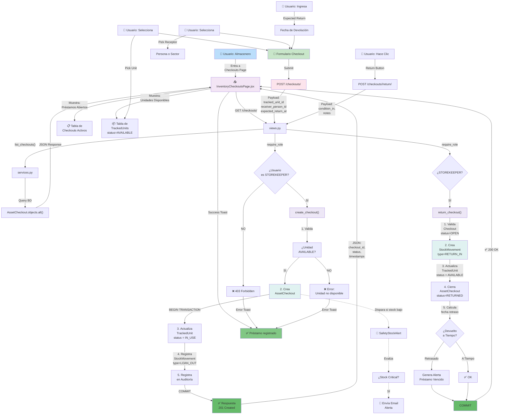

# Flujo Completo de Préstamo (Checkout) y Devolución

Este diagrama documentación detallada del flujo de préstamo de activos/unidades trazadas, desde que se solicita el préstamo hasta que se devuelve.

## Flujo Completo



## Fases del Checkout

### 📋 FASE 1: Visualización y Selección

**Vista: InventoryCheckoutsPage.jsx**

```
Pantalla dividida en:

1. Tabla "Préstamos Abiertos"
   - Col: Status (OPEN/OVERDUE)
   - Col: Unidad (CON-001)
   - Col: Donde (Taller)
   - Col: Quién (Juan García)
   - Col: Vence (10/04/2026)
   - Col: Acción (Devolver)

2. Panel "Crear Préstamo"
   - Selector: ¿Qué unidad prestar?
   - Selector: ¿A quién o qué sector?
   - Fecha: ¿Cuándo debe devolverse?
   - Botón: "Prestar"

3. Tabla "Unidades Disponibles"
   - Solo muestra status=AVAILABLE
   - Col: Código (CON-001)
   - Col: Artículo (Laptop)
   - Col: Ubicación (Almacén)
```

### 🔐 FASE 2: Creación de Préstamo

**Endpoint:** `POST /api/inventory/checkouts/`

**Request:**
```json
{
  "tracked_unit_id": 42,
  "receiver_person_id": 5,
  "expected_return_at": "2026-04-15"
}
```

**Validaciones:**

| Validación | Qué verifica | Si falla |
|------------|-------------|-----------|
| Autenticación | ¿Usuario logged in? | 401 Unauthorized |
| Autorización | ¿Es STOREKEEPER? | 403 Forbidden |
| Unidad existe | ¿ID válido? | 404 Not Found |
| Status AVAILABLE | ¿Está disponible? | 400 Bad Request |
| Receptor | ¿person_id O sector_id? | 400 Bad Request |
| Fecha válida | ¿expected_return > hoy? | 400 Bad Request |

**Lógica: create_checkout()**

```python
def create_checkout(payload, user):
    # 1. Parsea
    unit_id = payload['tracked_unit_id']
    person_id = payload['receiver_person_id']
    expected_return = payload['expected_return_at']
    
    # 2. Valida
    unit = TrackedUnit.objects.get(id=unit_id)
    if unit.status != 'AVAILABLE':
        raise ValidationError("Unidad no disponible")
    
    person = Person.objects.get(id=person_id)
    
    # 3. Transacción ACID
    with transaction.atomic():
        # A. Crea checkout
        checkout = AssetCheckout.objects.create(
            tracked_unit=unit,
            receiver_person=person,
            expected_return_at=expected_return,
            recorded_by=user,
            checked_out_at=now()
        )
        
        # B. Actualiza unidad
        unit.status = 'IN_USE'
        unit.current_holder_person = person
        unit.current_location = person.sector.location  # Opcional
        unit.save(update_fields=['status', ...])
        
        # C. Registra movimiento
        StockMovement.objects.create(
            movement_type='LOAN_OUT',
            tracked_unit=unit,
            recorded_by=user,
            timestamp=now(),
            source_location=unit.current_location,
            target_location=None,  # Prestamo es "fuera del sistema"
            # ... otros campos
        )
        
    # 4. Retorna
    return serialize_checkout(checkout)
```

**Response:**
```json
{
  "id": 123,
  "tracked_unit": {
    "id": 42,
    "internal_tag": "CON-001",
    "article": "Laptop HP"
  },
  "receiver_person": {
    "id": 5,
    "employee_code": "EMP-001",
    "name": "Juan García"
  },
  "status": "OPEN",
  "checked_out_at": "2026-04-10T14:30:00Z",
  "expected_return_at": "2026-04-15T00:00:00Z",
  "recorded_by": "Almacenero"
}
```

### ✅ FASE 3: Monitoreo de Préstamos Abiertos

**Estado: OPEN**

Durante el período de préstamo:

```
Cada 10 minutos (Reconciliation Task):
  ├─ Obtiene todos checkouts status=OPEN
  ├─ ¿expected_return_at < ahora?
  │  ├─ SÍ: status = OVERDUE, alerta generada
  │  └─ NO: sin cambios
  └─ Continúa
```

**Visualización en Panel:**

```
Préstamo         Status      Vence       Días
CON-001 Laptop   OPEN        10/04/26    -2 (vencido!)
CON-002 Mouse    OPEN        12/04/26    +2 (en plazo)
```

### 📤 FASE 4: Devolución

**Endpoint:** `POST /api/inventory/checkouts/<id>/return/`

**Request:**
```json
{
  "condition_in": "good",
  "notes": "Sin novedad"
}
```

**Opciones de condition_in:**
- `good` - Sin daños
- `damaged_minor` - Daño menor (rasguño, etc)
- `damaged_major` - Daño serio (no funciona)
- `lost` - Se perdió

**Lógica: return_checkout()**

```python
def return_checkout(checkout_id, payload, user):
    checkout = AssetCheckout.objects.get(id=checkout_id)
    
    # 1. Valida que esté OPEN
    if checkout.status != 'OPEN':
        raise ValidationError("Checkout no está abierto")
    
    # 2. Transacción ACID
    with transaction.atomic():
        # A. Actualiza checkout
        checkout.status = 'RETURNED'
        checkout.returned_at = now()
        checkout.condition_in = payload['condition_in']
        checkout.notes = payload['notes']
        checkout.authorized_by = user
        checkout.save()
        
        # B. Actualiza unidad
        unit = checkout.tracked_unit
        new_status = {
            'good': 'AVAILABLE',
            'damaged_minor': 'REPAIR',
            'damaged_major': 'OUT_OF_SERVICE',
            'lost': 'LOST',
        }[payload['condition_in']]
        
        unit.status = new_status
        unit.current_holder_person = None
        if new_status == 'REPAIR':
            unit.last_revision_at = now()
        unit.save()
        
        # C. Registra movimiento
        StockMovement.objects.create(
            movement_type='RETURN_IN',  # Entra al stock
            tracked_unit=unit,
            recorded_by=user,
            timestamp=now(),
            reason_text=f"Return: {payload['condition_in']}"
        )
        
        # D. Calcula retraso
        days_late = (now() - checkout.expected_return_at).days
        if days_late > 0:
            # Genera alerta
            Communication.create_inventory_alarm(
                type='CHECKOUT_OVERDUE',
                article=unit.article,
                person=checkout.receiver_person,
                days_overdue=days_late
            )
    
    return serialize_checkout(checkout)
```

**Response:**
```json
{
  "id": 123,
  "status": "RETURNED",
  "returned_at": "2026-04-12T10:15:00Z",
  "condition_in": "good",
  "days_late": 0,
  "notes": "Sin novedad"
}
```

## Modelos Involucrados

### AssetCheckout
```python
class AssetCheckout(models.Model):
    tracked_unit = ForeignKey(TrackedUnit)
    checkout_kind = CharField(choices=['loan', 'assignment'])
    status = CharField(
        choices=['OPEN', 'RETURNED', 'OVERDUE', 'CANCELLED'],
        default='OPEN'
    )
    
    # Receptor
    receiver_person = ForeignKey(Person, null=True)
    receiver_sector = ForeignKey(Sector, null=True)
    
    # Fechas
    checked_out_at = DateTimeField()
    expected_return_at = DateTimeField()
    returned_at = DateTimeField(null=True)
    
    # Condición
    condition_out = CharField(default='unknown')
    condition_in = CharField(null=True)
    
    # Auditoría
    recorded_by = ForeignKey(User, related_name='checkouts_recorded')
    authorized_by = ForeignKey(User, null=True, related_name='checkouts_authorized')
    created_at = DateTimeField(auto_now_add=True)
    
    class Meta:
        constraints = [
            # Debe tener receptor
            models.Q(receiver_person__isnull=False) | 
            models.Q(receiver_sector__isnull=False)
        ]
```

### TrackedUnit
```python
class TrackedUnit(models.Model):
    internal_tag = CharField(max_length=20, unique=True)  # CON-001
    article = ForeignKey(Article)
    
    status = CharField(
        choices=[
            'AVAILABLE',      # Disponible para prestar
            'IN_USE',         # Alguien lo tiene
            'REPAIR',         # En reparación
            'OUT_OF_SERVICE', # No funciona
            'LOST',           # Perdido
            'RETIRED',        # Dado de baja
        ],
        default='AVAILABLE'
    )
    
    # Ubicación actual
    current_location = ForeignKey(Location, null=True)
    current_sector = ForeignKey(Sector, null=True)
    current_holder_person = ForeignKey(Person, null=True)  # ← Quién lo tiene
    
    # Datos técnicos
    serial_number = CharField(null=True)
    brand = CharField(null=True)
    model = CharField(null=True)
    purchase_date = DateField(null=True)
    last_revision_at = DateTimeField(null=True)
    
    class Meta:
        constraints = [
            models.CheckConstraint(
                check=models.Q(current_location__isnull=False) |
                      models.Q(current_sector__isnull=False) |
                      models.Q(current_holder_person__isnull=False),
                name='unit_must_have_location'
            )
        ]
```

## Casos de Uso Comunes

### Caso 1: Préstamo a Persona
```
Usuario: "Necesito prestar una Laptop a Juan García hasta el 15/04"

1. Entra a Checkouts
2. Busca unidad disponible (CON-001)
3. Selecciona: Receptor → "Juan García"
4. Ingresa: Fecha → "2026-04-15"
5. Click: "Prestar"

Sistema:
  ✓ Crea AssetCheckout
  ✓ Actualiza TrackedUnit (AVAILABLE → IN_USE)
  ✓ Registra StockMovement (LOAN_OUT)
  ✓ Envía notificación a Juan

Resultado: ✅ Préstamo activo
```

### Caso 2: Devolución a Tiempo
```
Usuario: "Juan devolvió la Laptop"

2. Busca préstamo (CON-001)
3. Hace click "Devolver"
4. Selecciona: Condición → "good"
5. Ingresa: Notas → "OK"
6. Click: "Confirmar Devolución"

Sistema:
  ✓ Cierra AssetCheckout (OPEN → RETURNED)
  ✓ Actualiza TrackedUnit (IN_USE → AVAILABLE)
  ✓ Registra StockMovement (RETURN_IN)
  ✓ Calcula: 0 días de retraso

Resultado: ✅ Devolución procesada
```

### Caso 3: Devolución Tardía con Daño
```
Usuario: "Juan devolvió laptop 2 días tarde y dañada"

Sistema detecta:
  ✓ Fecha: 12/04 > 15/04 = 2 días retraso
  ✓ Condición: damaged_major

Acciones:
  ✓ Cierra checkout
  ✓ Marca unidad como OUT_OF_SERVICE
  ✓ Genera alerta "CHECKOUT_OVERDUE"
  ✓ Genera alerta "ASSET_DAMAGED"

Resultado: ⚠️ Requiere acción manual
```

### Caso 4: Préstamo Vencido
```
Escenario: Préstamo de CON-002 vence hoy

Cada 10 minutos (Reconciliation Task):
  ✓ Evalúa todos checkouts OPEN
  ✓ CON-002: expected_return < ahora?
  ✓ SÍ: Cambia status → OVERDUE

UI Actualizada:
  Status: OVERDUE (color rojo)
  Días: -2

Email enviado:
  "Préstamo vencido: CON-002 (Sector Taller)"
  "Devolver urgentemente"

Resultado: ⚠️ Alerta enviada
```

## Permisos y Roles

| Acción | STOREKEEPER | SUPERVISOR | MAINTENANCE | OPERATOR |
|--------|-------------|-----------|-------------|----------|
| Ver checkouts abiertos | ✅ | ✅ | ✅ | ❌ |
| Crear checkout | ✅ | ⚠️ | ✅ | ❌ |
| Devolver | ✅ | ⚠️ | ✅ | ❌ |
| Editar checkout | ❌ | ✅ | ❌ | ❌ |

## Consideraciones Importantes

### ⚠️ Integridad
- Solo STOREKEEPER puede crear/devolver
- TrackedUnit debe estar AVAILABLE
- Transacción ACID garantiza consistencia

### ⚠️ Auditoría
- Quién, cuándo, qué
- Condición initial/final
- Motto si está vencido

### ⚠️ Alertas
- Email cuando checkout vence
- Notificación si hay retraso
- Integración con Communications module

### ⚠️ Performance
- Índice en (tracked_unit, status)
- Query optimizada para OPEN checkouts
- Cálculo de retraso en memoria (no DB)
