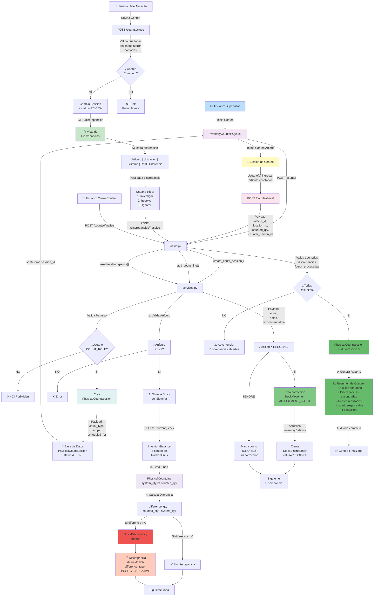

# Flujo de Conteo Físico y Resolución de Discrepancias

Este diagrama documenta el proceso completo de realizar un conteo físico de inventario, detectar diferencias y resolverlas.

## Flujo Completo



## Fases del Conteo

### 📋 FASE 1: Creación de Sesión

**Endpoint:** `POST /api/inventory/counts/`

**Request:**
```json
{
  "count_type": "general",
  "scope": "Almacén Principal",
  "scheduled_for": "2026-04-10",
  "notes": "Conteo completo mensual"
}
```

**Opciones de count_type:**

| Tipo | Descripción | Scope | Quién |
|------|-------------|-------|-------|
| `general` | Todos artículos | Almacén completo | SUPERVISOR |
| `partial` | Algunos artículos | Lista específica | STOREKEEPER |
| `sector` | Por departamento | Sector específico | SUPERVISOR |
| `family` | Por familia de artículos | Categoría | STOREKEEPER |
| `cyclic` | Conteo rotativo | % de stock | SUPERVISOR |

**Lógica: create_count_session()**

```python
def create_count_session(payload, user):
    # 1. Valida permisos
    if user.profile.role not in ['SUPERVISOR', 'STOREKEEPER']:
        raise ValidationError("Permiso insuficiente")
    
    # 2. Crea sesión
    session = PhysicalCountSession.objects.create(
        count_type=payload['count_type'],
        scope=payload['scope'],
        scheduled_for=payload['scheduled_for'],
        status='OPEN',
        created_by=user,
        notes=payload.get('notes', '')
    )
    
    return serialize_count_session(session)
```

**Response:**
```json
{
  "id": 456,
  "count_type": "general",
  "scope": "Almacén Principal",
  "status": "OPEN",
  "created_at": "2026-04-10T09:00:00Z",
  "created_by": "supervisor1"
}
```

### 🔍 FASE 2: Registro de Líneas de Conteo

**Durante:** Equipo físico cuenta artículos en almacén

**Endpoint:** `POST /api/inventory/counts/<session_id>/lines/`

**Request (para cada artículo contado):**
```json
{
  "article_id": 123,
  "location_id": 45,
  "counted_qty": 85,
  "counter_person_id": 7
}
```

**Lógica: add_count_line()**

```python
def add_count_line(session_id, payload, user):
    session = PhysicalCountSession.objects.get(id=session_id)
    
    # 1. Validar sesión abierta
    if session.status != 'OPEN':
        raise ValidationError("Sesión no abierta")
    
    # 2. Validar artículo
    article = Article.objects.get(id=payload['article_id'])
    location = Location.objects.get(id=payload['location_id'])
    counter = Person.objects.get(id=payload['counter_person_id'])
    
    # 3. Obtener stock del sistema
    if article.tracking_mode == 'QUANTITY':
        # Por cantidad: usar InventoryBalance
        balance = InventoryBalance.objects.filter(
            article=article,
            location=location
        ).first()
        system_qty = balance.on_hand if balance else 0
    else:
        # Por unidad: contar TrackedUnits activos
        system_qty = TrackedUnit.objects.filter(
            article=article,
            current_location=location,
            status='AVAILABLE'
        ).count()
    
    # 4. Crear línea de conteo
    count_line = PhysicalCountLine.objects.create(
        session=session,
        article=article,
        location=location,
        system_qty=system_qty,
        counted_qty=payload['counted_qty'],
        counter_person=counter,
        review_status='pending',
        created_by=user
    )
    
    # 5. Calcular diferencia
    difference_qty = payload['counted_qty'] - system_qty
    
    if difference_qty != 0:
        # Crear discrepancia
        discrepancy = StockDiscrepancy.objects.create(
            article=article,
            location=location,
            count_line=count_line,
            difference_qty=difference_qty,
            difference_type='POSITIVE' if difference_qty > 0 else 'NEGATIVE',
            status='OPEN',
            detected_by=user,
            detected_at=now()
        )
        
        return {
            'line': serialize_line(count_line),
            'discrepancy': serialize_discrepancy(discrepancy)
        }
    else:
        return {
            'line': serialize_line(count_line),
            'discrepancy': None
        }
```

**Ejemplo: Conteo de Guantes Nitrilo**

```
Sistema:
  Ubicación: Almacén Principal
  Artículo: "Guantes Nitrilo Talla M"
  Stock registrado: 100 unidades

Conteo Físico:
  Almacenero cuenta: 95 unidades

Diferencia:
  95 - 100 = -5 unidades (FALTANTE)

Discrepancia Generada:
  difference_qty: -5
  difference_type: NEGATIVE
  possible_cause: "???" (sin detectar)

Próximos pasos:
  1. Investigar dónde se fueron 5
  2. Resolver discrepancia (ajuste)
```

### ✅ FASE 3: Cierre de Sesión y Revisión

**Endpoint:** `POST /api/inventory/counts/<session_id>/close`

**Request:**
```json
{
  "review_notes": "Conteo completado"
}
```

**Validaciones:**

```python
def close_count_session(session_id, payload, user):
    session = PhysicalCountSession.objects.get(id=session_id)
    
    # 1. Valida que tenga líneas
    line_count = PhysicalCountLine.objects.filter(session=session).count()
    if line_count == 0:
        raise ValidationError("Sin líneas de conteo")
    
    # 2. Notifica discrepancias pendientes
    pending_disc = StockDiscrepancy.objects.filter(
        count_line__session=session,
        status='OPEN'
    ).count()
    
    if pending_disc > 0:
        # Advertencia pero permitir
        log_warning(f"{pending_disc} discrepancias sin resolver")
    
    # 3. Cambia status
    session.status = 'REVIEW'
    session.save()
```

**UI en fase REVIEW:**

```
Status: REVIEW (amarillo)

Opciones:
1. ✏️ Editar líneas (reabrir para corregir)
2. 📹 Ver discrepancias
3. ✅ Finalizar (si todas resueltas)
4. ❌ Cancelar (descartar conteo)
```

### 🔍 FASE 4: Resolución de Discrepancias

**Vista:** InventoryDiscrepanciesPage

**Tabla de Discrepancias:**

```
Artículo       | Ubicación              | Sistema | Real | Dif  | Acción
─────────────────────────────────────────────────────────────────────
Guantes Nitrilo | Almacén Principal      | 100    | 95   | -5   | [resolver]
Tiner          | Almacén Principal      | 20     | 25   | +5   | [resolver]
Tinta Azul     | Almacén Principal      | 50     | 50   | 0    | ✓
```

**Endpoint:** `POST /api/inventory/discrepancies/<disc_id>/resolve`

**Request:**
```json
{
  "action": "RESOLVE",
  "notes": "Encontrados 5 guantes dañados, descartados",
  "recommended_qty": 95
}
```

**Opciones de action:**

| Action | Effect | Stock | Acude |
|--------|--------|-------|-------|
| `RESOLVE` | Ajusta a cantidad real | Sí ✓ | Movimiento ADJUSTMENT |
| `IGNORE` | Cierra sin ajuste | No | Solo auditoría |
| `INVESTIGATE` | Marca como investigando | No | Requiere seguimiento |

**Lógica: resolve_discrepancy()**

```python
def resolve_discrepancy(discrepancy_id, payload, user):
    disc = StockDiscrepancy.objects.get(id=discrepancy_id)
    
    if payload['action'] == 'RESOLVE':
        # 1. Crear movimiento de ajuste
        if disc.difference_qty > 0:
            movement_type = 'ADJUSTMENT_IN'
        else:
            movement_type = 'ADJUSTMENT_OUT'
        
        movement = StockMovement.objects.create(
            movement_type=movement_type,
            article=disc.article,
            quantity=abs(disc.difference_qty),
            location=disc.location,
            reason_text=f"Ajuste conteo: {payload['notes']}",
            recorded_by=user,
            timestamp=now()
        )
        
        # 2. Actualizar balance (si es QUANTITY)
        if disc.article.tracking_mode == 'QUANTITY':
            balance = InventoryBalance.objects.get(
                article=disc.article,
                location=disc.location
            )
            balance.apply_balance_delta(disc.difference_qty)
        
        # 3. Marcar discrepancia como resuelta
        disc.status = 'RESOLVED'
        disc.approved_by = user
        disc.save()
        
    elif payload['action'] == 'IGNORE':
        # Simplemente ignora la diferencia
        disc.status = 'IGNORED'
        disc.approved_by = user
        disc.notes = payload.get('notes', '')
        disc.save()
```

**Ejemplo de Resolución:**

```
Discrepancia: -5 Guantes (faltante)

Usuario investiga:
  "Encontré 5 guantes en la bandeja de descarte"
  "Estaban dañados, sin valor. Descartados."

Acción: RESOLVE
  ✓ Crea StockMovement (ADJUSTMENT_OUT, -5)
  ✓ Actualiza InventoryBalance (100 → 95)
  ✓ Marca discrepancia como RESOLVED

Stock Final: 95 unidades ✅
Auditoría: "Ajuste por conteo 2026-04-10"
```

### ✔️ FASE 5: Finalización

**Endpoint:** `POST /api/inventory/counts/<session_id>/finalize`

**Validaciones:**

```python
def finalize_count_session(session_id, user):
    session = PhysicalCountSession.objects.get(id=session_id)
    
    # 1. Status debe ser REVIEW
    if session.status != 'REVIEW':
        raise ValidationError("Sesión no en REVIEW")
    
    # 2. Todas las discrepancias resueltas?
    pending = StockDiscrepancy.objects.filter(
        count_line__session=session,
        status='OPEN'  # Invest. = ok, Ignored = ok
    ).count()
    
    if pending > 0:
        raise ValidationError(f"{pending} discrepancias sin resolver")
    
    # 3. Cambiar status
    session.status = 'CLOSED'
    session.closed_by = user
    session.closed_at = now()
    session.save()
```

**Reporte Generado:**

```python
def build_count_report(session):
    lines = PhysicalCountLine.objects.filter(session=session)
    discrepancies = StockDiscrepancy.objects.filter(
        count_line__session=session
    )
    
    report = {
        'session_id': session.id,
        'date': session.closed_at,
        'count_type': session.count_type,
        'scope': session.scope,
        
        'statistics': {
            'total_lines': lines.count(),
            'articles_counted': lines.values('article').distinct().count(),
            'locations': lines.values('location').distinct().count(),
            'discrepancies_found': discrepancies.filter(
                status__in=['RESOLVED', 'IGNORED']
            ).count(),
            'adjustments_made': StockMovement.objects.filter(
                movement_type='ADJUSTMENT_IN' | 'ADJUSTMENT_OUT',
                timestamp__gte=session.created_at
            ).count(),
        },
        
        'summary': f"""
            Conteo Físico: {session.count_type}
            Fecha: {session.closed_at}
            Supervisor: {session.created_by.get_full_name()}
            
            Artículos contados: {lines.count()}
            Discrepancias: {discrepancies.count()}
            
            Resultados:
            - Positivas (Sobrante): X
            - Negativas (Faltante): Y
            - Resueltas: Z
        """
    }
    
    return report
```

## Modelos Involucrados

### PhysicalCountSession
```python
class PhysicalCountSession(models.Model):
    count_type = CharField(
        choices=['general', 'partial', 'sector', 'family', 'cyclic'],
        default='general'
    )
    scope = CharField()  # "Almacén", "Sector Taller", etc
    scheduled_for = DateField()
    status = CharField(
        choices=['OPEN', 'REVIEW', 'CLOSED'],
        default='OPEN'
    )
    created_by = ForeignKey(User)
    closed_by = ForeignKey(User, null=True)
    notes = TextField(blank=True)
    created_at = DateTimeField(auto_now_add=True)
    closed_at = DateTimeField(null=True)
```

### PhysicalCountLine
```python
class PhysicalCountLine(models.Model):
    session = ForeignKey(PhysicalCountSession)
    article = ForeignKey(Article)
    location = ForeignKey(Location)
    
    system_qty = PositiveIntegerField()  # Lo que dice el sistema
    counted_qty = PositiveIntegerField()  # Lo que contó el equipo
    
    counter_person = ForeignKey(Person)
    review_status = CharField(  # Seguimiento de revisión
        choices=['pending', 'reviewed', 'approved'],
        default='pending'
    )
    approved_by = ForeignKey(User, null=True)
    
    class Meta:
        unique_together = [['session', 'article', 'location']]
```

### StockDiscrepancy
```python
class StockDiscrepancy(models.Model):
    article = ForeignKey(Article)
    location = ForeignKey(Location)
    count_line = ForeignKey(PhysicalCountLine, null=True)
    
    difference_qty = IntegerField()  # counted - system
    difference_type = CharField(  # POSITIVE o NEGATIVE
        choices=['POSITIVE', 'NEGATIVE']
    )
    
    status = CharField(
        choices=['OPEN', 'RESOLVED', 'IGNORED', 'INVESTIGATING'],
        default='OPEN'
    )
    
    detected_by = ForeignKey(User)
    detected_at = DateTimeField()
    possible_cause = TextField(blank=True)
    approved_by = ForeignKey(User, null=True)
    notes = TextField(blank=True)
```

## Flujo Resumido

```
1. ABRIR
   └─ Crear PhysicalCountSession

2. REGISTRAR (múltiples líneas)
   └─ POST línea → calcula diferencia → crea discrepancia si hay

3. CERRAR
   └─ Status OPEN → REVIEW

4. RESOLVER
   └─ Para cada discrepancia:
      ├─ Si RESOLVER: StockMovement + InventoryBalance
      └─ Si IGNORAR: solo registro

5. FINALIZAR
   └─ Status REVIEW → CLOSED
   └─ Genera reporte

6. AUDITORÍA
   └─ Todo queda registrado con quién/cuándo/qué
```

## Consideraciones

### ⚠️ Integridad
- Discrepancias se crean automáticamente
- Ajustes son transaccionales
- Stock nunca queda inconsistente

### ⚠️ Auditoría
- Quién contó qué
- Qué diferencia había
- Quién resolvió y cómo
- Timestamp de todo

### ⚠️ Performance
- Índice en (session, article, location)
- Queries optimizadas para reportes
- Cálculos de diferencia en memoria

### ⚠️ Reporte
- Disponible después del cierre
- Descargable en PDF/Excel
- Firmable digitalmente (futuro)
